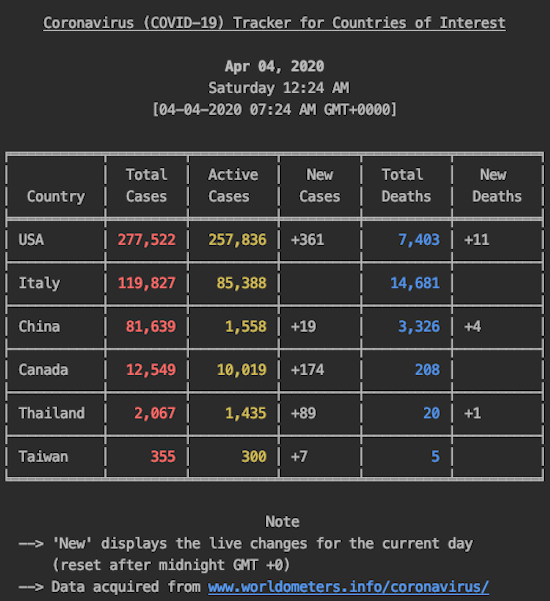

# Global Coronavirus (COVID-19) CLI Tracker

This is a CLI tracker of the Coronavirus (COVID-19) for specific countries of interest.
Information for each country is live and current. They include data on: total cases, total deaths, new cases, new deaths.
All the COVID-19 data displayed are extracted from [Worldometers](https://www.worldometers.info/coronavirus/).

**Note** Formatting may not display properly on Windows as there is a lack of ANSI escape sequence support. No tests have been run on Windows yet. If you dicover any bugs regrading this (or anything), please contact me.

### Screenshots

	
	

## Installing
Make sure that Python is version 3.6+.
 
Simply install the necessary dependencies first by running the command `pip install -r requirements.txt` (use `pip3` if on macOS)

### Dependencies
The CLI is a Python 3 (supports **3.6+**) script utilizing the following external libraries:

* [beautifulsoup4](https://pypi.org/project/beautifulsoup4/)
* [colorama](https://pypi.org/project/colorama/)
* [pytz](https://pypi.org/project/pytz/)
* [requests](https://pypi.org/project/requests/)
* [tabulate](https://pypi.org/project/tabulate/)

For specific versions of these dependencies, please check the requirements file in this repo.
 
**Note** on Beautiful Soup and using the best parser:

* lxml's HTML parser `("lxml")`
	- need to install parser using pip or other setup commands
	- very fast
* Python's html.parser `("html.parser")`
	- do not need to install any dependencies
	- not as fast

To change the parser, simply change the second string argument in the initialization of the BeautifulSoup object. For more details concerning installation of parsers (as well as their differences), please refer to the [official reference](https://www.crummy.com/software/BeautifulSoup/bs4/doc/#installing-a-parser).

## Customizations
A prompt will be shown to the user upon execution. 
If the user wishes to display the default countries, simply enter blank to conintue.
The default countries displayed are *USA, Italy, China, Canada, Thailand, and Taiwan*.

**Regarding Color**: The colored fonts displayed could be different depending on the theme preferences set for the command line/terminal.

**Display other countries** (Not default): Upon seeing the initial prompt, enter any character or string. Type desired countries to observe by typing their official names separated by commas.

**Change default countries**: To permanantly change the default countries displayed (every time the script is run) simply modify the list of countries saved in the variable `default_countries` 

**Table format/ Display design**: Column alignment of the table can be changed by modifying the `colalign` tuple parameter when using `tabulate()`. More details are provided [here](https://pypi.org/project/tabulate/). Other design modifications can be made in the `format_and_display_cli()` function.

## Contributing

If you experience any bugs or see anything that can be improved or added, please feel free to [open an issue](https://github.com/PeterBohai/covid19-CLI-Tracker/issues) here or simply contact me on any of my socials ([Linkedin](https://www.linkedin.com/in/peterhu08)). Thanks in advance!